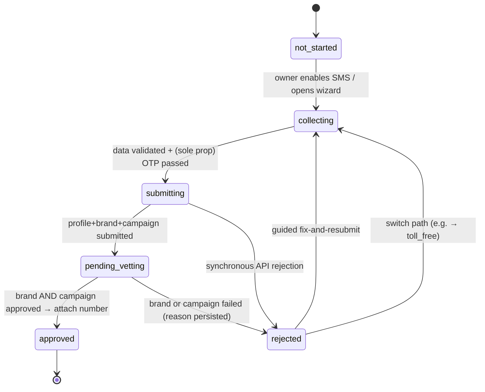

# A2P 10DLC Registration for Customer SMS — Plan

**Status: Planned — not started.**

Every Rivus business gets a rented Twilio number that fronts SMS, voice, and WhatsApp
(`packages/api/src/services/twilio.ts` provisions it; `packages/api/src/routes/account-channels.ts`
enables it). US carriers require A2P 10DLC registration — a business **Brand** plus a use-case
**Campaign**, with the number attached to a Messaging Service under that campaign — before a
10-digit local number may **send** application SMS to US phones. Inbound texts already arrive fine,
but the agent's outbound replies are blocked or heavily filtered (Twilio error 30034 territory)
until registration is approved. Today registration is a manual per-business console task; this plan
automates it, the same way the existing `TODO(twilio)` in `twilio.ts` contemplates automating
WhatsApp sender registration.

> **Volatile-facts convention used throughout:** exact fees, throughput caps, SID prefixes, and
> Twilio endpoint/SDK names change frequently. Anything marked **[verify at build]** must be
> checked against current Twilio/TCR docs when the phase that uses it is implemented. The
> *shape* of the flow (secondary profile → brand → campaign → messaging service → number) has been
> stable for years and is safe to plan against.

---

## 1. Why mom-and-pop 10DLC registrations get rejected — and what Rivus does about it

This is the heart of the plan. Rivus's customers are mom-and-pop businesses, and industry-wide the
brand-vetting failure rate for tiny businesses is high. Every known failure mode has a concrete
mitigation, and most of them Rivus can eliminate *structurally* rather than coach around:

| # | Failure mode | Root cause | Rivus mitigation |
|---|--------------|------------|------------------|
| 1 | **No EIN at all** — brand registration fails outright | Standard/Low-Volume brand registration requires a US EIN. Many mom-and-pops are sole proprietors who have never obtained one. | Route them to the **Sole Proprietor 10DLC** path, created exactly for this case: the owner's personal legal name + a mobile-phone OTP verification, no EIN. Tradeoffs (low throughput, one campaign, one number) are fine for conversational appointment traffic. See §6. |
| 2 | **Legal name / EIN mismatch** — TCR identity check fails | Owner enters their DBA ("Sunny's Nails") instead of the legal name on IRS records ("Sun Yi LLC"), or a typo'd EIN. TCR matches against IRS/tax records **exactly**. | Collect legal name + EIN + address in a dedicated step with copy that says "exactly as it appears on your IRS letter (CP-575) or tax return, not your storefront name." Validate EIN format hard (9 digits) and run a **KYB/TIN pre-check** (e.g. Middesk or similar — vendor **[verify at build]**) *before* paying to submit. A failed standard vet costs a non-refundable fee; a pre-check is cheaper than a resubmit. |
| 3 | **Wrong brand tier** — over-registering | Submitting a tiny business for full Standard vetting invites scrutiny (and fees) it can't survive. | Default EIN-holding businesses to **Low Volume Standard**: cheaper vetting, fits under roughly ~2,000 msgs/day **[verify at build]**, which covers essentially every Rivus customer's appointment traffic. |
| 4 | **Campaign rejected: bad sample messages** | Missing business identification, missing STOP/opt-out language, samples that don't match the declared use case. | Rivus **controls the message content** — the AI agent composes every outbound SMS. Hold the campaign **constant**: one Rivus-authored, pre-vetted campaign definition (conversational / customer-care) with compliant sample messages that template in the business name and always include STOP language and the opt-in description. Businesses never write campaign content. |
| 5 | **Use-case mismatch** | Registering "customer care" then sending marketing blasts, or declaring "mixed" ambiguously. | The agent only sends conversational scheduling replies and appointment confirmations/reminders — enforce that in product (no promo sends over SMS) and register the matching **conversational/customer-initiated** use case, the easiest category to approve. |
| 6 | **Weak or undocumented consent/opt-in** — a top rejection reason industry-wide | Vague "users opt in on our website" descriptions with no evidence. | Rivus's model is the strongest consent that exists: **the customer texts the business first** (inbound-initiated, two-way conversational). Document that verbatim in the campaign's opt-in description, plus explicit SMS-consent capture on the self-signup/booking form as reinforcement. Twilio Messaging Service default STOP/HELP handling stays on; the send path must treat opted-out errors (Twilio 21610 **[verify at build]**) as terminal, not retryable. |
| 7 | **Unverifiable business footprint** | Vetting cross-checks address, phone, and (for standard vetting) web presence; inconsistent data fails. | Prefill from the `Account` record (`name`, `phone`, `address`, `website` already exist in `packages/core/src/types.ts`) and normalize the address (USPS-style) before submit. Sole-prop path does not require a website. |
| 8 | **Sole-prop OTP never completed** | TCR texts a one-time code to the owner's mobile; the owner ignores or misses it and the brand stalls. | Make the OTP an explicit, blocking wizard step ("check your phone now"), with in-product and email nudges, and an API-triggered OTP re-send (Twilio exposes a re-trigger endpoint **[verify at build]**). |

## 2. Strategy: keeping the rejection rate low

The core insight: **Rivus can standardize everything that usually fails — the campaign, the sample
messages, the consent flow, the use case — and let only the brand-identity data vary per business.**
Registration failures then collapse to a single, tractable problem: *collect and validate one
business's identity correctly, and route it to the right registration type.*

Concrete tactics, in priority order:

1. **One pre-vetted campaign template, owned by Rivus.** Same use case (conversational /
   customer care), same sample messages (business name templated in), same opt-in/opt-out
   descriptions, for every customer. Iterate on the template centrally when carriers' review
   criteria shift; individual businesses never author campaign content.
2. **Register the easiest true use case.** Two-way, customer-initiated conversational messaging is
   both what Rivus actually does and the most approvable category. Keep marketing out of scope —
   in the registration *and* in the product.
3. **Lead with the strongest consent story.** Inbound-first ("the consumer texts the business's
   published number to start every conversation") plus explicit checkbox consent on the booking
   form. State it plainly in the campaign submission.
4. **Route by identity, not by hope.** EIN present → Low Volume Standard. No EIN → Sole
   Proprietor. Can't pass either → Toll-free verification fallback (§9). Never submit a no-EIN
   business down the standard path just because the form allowed it.
5. **Validate before you pay.** Hard client- and server-side validation (EIN format, exact-name
   copywriting, address normalization) plus an optional KYB/TIN pre-match service, so submissions
   that would bounce never get submitted.
6. **Persist every rejection reason and drive a guided fix-and-resubmit UX** (§5 state machine).
   Rejections become a workflow state, not a support ticket.
7. **Fail forward, never dead-end.** A business that can't pass 10DLC gets offered toll-free
   verification (lighter identity bar) or WhatsApp, or the managed white-glove path — outbound SMS
   is degraded, never silently broken.
8. **Human-in-the-loop early.** Phase 1 keeps a Rivus staff review before submission; automation
   ramps only as first-pass approval data justifies it.

Target: **>90% first-pass brand+campaign approval**, median time-to-approved measured and reported
per registration path.

## 3. Goals / Non-goals

**Goals**

- Any US business that signs up reaches *approved outbound SMS* with minimal owner effort:
  one identity-collection wizard, at most one OTP tap, no Twilio-console exposure.
- Registration status is first-class product state: stored, visible to the owner, driving the UI.
- Outbound US SMS is gated on approval; nothing else is (voice, WhatsApp, email, inbound SMS all
  work day one).
- Per-business marginal work is near zero after approval — a second number joins the existing
  Messaging Service.
- Rejection handling is a guided loop, not a dead end.

**Non-goals**

- Marketing/promotional SMS campaigns, bulk blasts, short codes, high-throughput tiers.
- Non-US numbers or non-US destination compliance (`TWILIO_NUMBER_COUNTRY` defaults to `US`;
  other countries have different regimes — out of scope).
- WhatsApp/WABA sender automation (the existing `TODO(twilio)` in
  `packages/api/src/services/twilio.ts`) — adjacent, and it reuses the business-identity data
  this plan collects (not the Trust Hub resource itself: WhatsApp senders consume no Trust Hub
  bundle — see `WHATSAPP_SENDER_PLAN.md` §7), but tracked separately.
- 10DLC compliance for legacy **Plivo-owned** numbers. The Plivo→Twilio migration
  (`packages/api/src/services/messaging-provider.ts`) supersedes it; migrate the number, then
  register it under this plan.
- Building a general-purpose campaign builder. There is exactly one campaign shape.

## 4. Architecture

### 4.1 ISV / CSP model

Rivus operates as the ISV: **one primary Twilio Trust Hub customer profile** for Rivus itself
(one-time, manual setup), then per customer business:

```
Secondary Customer Profile  →  A2P Brand  →  A2P Campaign  →  Messaging Service  →  number(s)
        (Trust Hub)             (TCR via Twilio)  (us_app_to_person)     (MG…)         (PN…)
```

Each customer is the compliant "business of record"; Rivus is the facilitating ISV. Registration is
**per business, not per number** — a business's second number simply joins the same Messaging
Service (near-zero marginal work). All of this lives under Rivus's single Twilio account, matching
today's single-credential setup (`TWILIO_ACCOUNT_SID`/`TWILIO_AUTH_TOKEN` in
`packages/api/src/config.ts`). Whether to move to per-customer Twilio **subaccounts** is an open
decision (§11) — not required for 10DLC.

### 4.2 Data model additions (`@rivus/core`)

Add a per-account registration object — top-level on `Account` (it is per business, not per
channel), alongside `channels`:

```ts
// packages/core/src/types.ts (new)
export type SmsRegistrationState =
  | 'not_started'      // SMS never enabled, or enabled pre-plan (backfill)
  | 'collecting'       // wizard open; identity data incomplete/unvalidated
  | 'submitting'       // Twilio/TCR calls in flight (profile/brand/campaign)
  | 'pending_vetting'  // submitted; awaiting brand and/or campaign review
  | 'approved'         // campaign approved; number attached; outbound unlocked
  | 'rejected';        // brand or campaign failed; rejection persisted; resubmit available

export type SmsRegistrationPath =
  | ''                     // undecided
  | 'sole_proprietor'      // no EIN — owner identity + mobile OTP
  | 'low_volume_standard'  // EIN — cheap vetting, low caps (the default with EIN)
  | 'standard'             // EIN — full vetting; only if a customer outgrows LVS
  | 'toll_free';           // fallback — toll-free number + toll-free verification

export interface SmsRegistration {
  state: SmsRegistrationState;
  path: SmsRegistrationPath;
  /** Which review is outstanding while pending_vetting: 'brand' | 'campaign' | 'tollfree'. */
  pendingStage: string;

  // Twilio resource ids, '' until created. Prefixes indicative — [verify at build].
  secondaryProfileSid: string;    // Trust Hub secondary customer profile (BU…)
  a2pTrustProductSid: string;     // A2P messaging trust product bundle (BU…)
  brandSid: string;               // brand registration (BN…)
  campaignSid: string;            // us_app_to_person campaign (QE…)
  messagingServiceSid: string;    // messaging service (MG…)
  tollfreeVerificationSid: string;

  /** Identity data collected from the owner (prefilled from Account where possible). */
  identity: {
    legalName: string;            // exact IRS-record name, NOT the DBA
    dbaName: string;              // customer-facing name (Account.name)
    ein: string;                  // '' on the sole-prop path; encrypted at rest
    entityType: string;           // LLC | corporation | sole_prop | … [verify enum at build]
    address: { street: string; city: string; region: string; postalCode: string; country: 'US' };
    website: string;              // optional; from Account.website
    contact: { firstName: string; lastName: string; email: string; mobilePhone: string; title: string };
  };

  rejection: null | {
    stage: 'brand' | 'campaign' | 'tollfree';
    code: string;                 // provider/TCR failure code
    message: string;              // human-readable reason, shown in the fix-it UX
    at: IsoDateString;
  };
  submittedAt: IsoDateString | null;
  approvedAt: IsoDateString | null;
  /** Append-only audit of state transitions (at, from, to, note). */
  history: Array<{ at: IsoDateString; from: string; to: string; note: string }>;
}
```

Wiring that follows from the existing patterns:

- `packages/core/src/schemas.ts`: zod schema + defaults (all-empty `not_started` object always
  present, like `AccountChannels` — plain reads, never existence checks).
- Repositories (in-memory + Mongo): `accounts.setSmsRegistration(...)` mirroring
  `setChannelConfig`.
- `packages/api/src/presenters.ts` (`toPublicAccount`): expose **state, path, pendingStage,
  rejection message, timestamps only**. Never expose `ein` or contact PII through the public
  account shape; redact `ein` from logs. Storage: encrypt EIN at rest (it is required again for
  resubmission, so it must be retained until approval — decide post-approval retention in §11).
- The number attach step reuses the already-stored `providerRef` (`PN…` SID) from
  `AccountChannelConfig` — no new number bookkeeping needed.

### 4.3 Registration state machine



Rules:

- Transitions are driven by Twilio status callbacks with a **polling reconciler as backstop** (§7).
  Every transition appends to `history`.
- `rejected` always carries a persisted `rejection` and re-enters at `collecting` with the fix-it
  UI focused on the failed field/stage. A path switch (e.g. LVS → sole prop, or → toll-free) is a
  `rejected → collecting` transition with `path` changed.
- **Outbound SMS to US destinations is allowed only in `approved`.** Everything else — voice,
  WhatsApp, email, inbound SMS — is never gated by this machine.
- While not approved: the app does not advertise the number for texting; if an inbound text
  arrives anyway, the agent must **not** attempt an SMS reply (it would be carrier-filtered) —
  instead the message is flagged to the owner via the existing notifier/inbox so a human can
  respond through another channel. Enforce the gate at the outbound dispatch seam
  (`dispatchPhoneChannelEvent` / the SMS adapter in `packages/api/src/services/agent/sms/`), not
  in the Twilio sender, so the rule is provider-agnostic and testable with the in-memory repos.

## 5. Registration-type routing

Decision logic at wizard time:

```
Does the business have a US EIN?
├─ YES → validate legal name + EIN (format + optional KYB pre-check)
│        → Low Volume Standard brand (default)
│          - upgrade to Standard only if a customer demonstrably outgrows LVS caps (rare; not built initially)
│        → on repeated identity failure (2 strikes) → offer Sole Proprietor (if truly a sole prop)
│          or Toll-free fallback
└─ NO  → Is there a single human owner with a US mobile number willing to OTP-verify?
         ├─ YES → Sole Proprietor brand
         │        constraints [verify at build]: low throughput (roughly ~1k msgs/day),
         │        ONE campaign, ONE number — acceptable for appointment traffic
         └─ NO  → Toll-free fallback (§9): lighter verification, no EIN strictly required,
                  higher default throughput — but the number is toll-free, not local
```

Notes:

- Ask the EIN question directly ("Do you have an EIN / Tax ID for this business?") with plain-
  language help text; don't infer.
- Sole-prop constraints are enforced by TCR, so the product must also enforce them: a sole-prop
  account gets exactly one number until it upgrades paths.
- Path is recorded in `SmsRegistration.path` and drives which wizard fields appear (no EIN field on
  the sole-prop path; mobile-OTP step only on the sole-prop path).

## 6. Onboarding UX & data collection

**When:** at SMS enable — keep signup friction at zero. `POST /channels/sms/enable`
(`packages/api/src/routes/account-channels.ts`) continues to rent the number exactly as today
(voice + inbound work immediately), and additionally initializes `smsRegistration` to
`collecting`, returning the account with the new status so the app can open the wizard.

**What to collect** (prefilled from `Account.name/phone/address/website` where possible):

- Path question: "Do you have an EIN?"
- EIN path: legal business name (with the "exactly as on your IRS CP-575 letter" copy), EIN,
  entity type, business address, website (optional), authorized-contact name/email/mobile/title.
- Sole-prop path: owner legal name, personal/business address, owner mobile number
  (OTP target), email. No EIN, no website required.
- Both paths: an explicit consent-model confirmation ("my customers text me first / consent is
  collected on my booking page") — informational, feeds the constant campaign description.

**Validation before submit (server-side, hard):** EIN = 9 digits; names non-empty and not
obviously the DBA when a legal-suffix heuristic disagrees (warn, don't block); US address
normalization; E.164 mobile; email deliverability check. Optional KYB/TIN pre-match (§2 tactic 5)
gated behind a config flag so it can be trialed.

**Sole-prop OTP step:** after submit, TCR texts a code to the owner's mobile. The wizard shows a
blocking "enter the code we texted you" screen, with re-send (API-triggered **[verify at build]**)
and a fallback nudge email after ~1 hour. Brand registration cannot proceed without it.

**Pending state:** the channels screen shows a status pill driven by
`smsRegistration.state`/`pendingStage` — e.g. "SMS: verification in review (usually 1–7 days)"
**[verify typical durations at build]**. Voice/WhatsApp/email rows are visibly unaffected.
On `rejected`, the pill becomes an action: "Fix and resubmit", opening the wizard focused on the
failed field with the persisted rejection message translated to plain language (maintain a
rejection-code → guidance copy map; grow it from real rejections). On `approved`, notify the owner
(existing notifier) — "your business can now text customers back."

All new UI follows `DESIGN_SYSTEM.md` tokens/components.

## 7. Twilio API flow (directional — **verify every endpoint/SDK name at build time**)

The ISV sequence per business, driven by a small orchestrator service
(new `packages/api/src/services/twilio-a2p.ts`, same fetch-based adapter style as
`twilio.ts`, injectable `fetchImpl` so tests stay hermetic):

1. **Secondary Customer Profile** (Trust Hub, `trusthub.twilio.com`): create the customer-profile
   bundle under Rivus's primary profile policy; create EndUser + address SupportingDocument from
   the collected identity; assign them; evaluate against the policy (catches missing fields
   *before* submission); submit the bundle for review.
2. **A2P Messaging Trust Product** (Trust Hub): create the `us_a2p_messaging_profile` trust
   product, attach the secondary profile, evaluate, submit.
3. **Brand registration** (`messaging.twilio.com` … `/a2p/BrandRegistrations`): create with the
   two bundle SIDs; brand type per path (LVS vs sole proprietor — exact parameter values
   **[verify at build]**). Sole prop: trigger/await the mobile OTP (re-send endpoint exists).
4. **Await brand approval** (webhook + poll, below). On failure → `rejected` with TCR failure
   reasons persisted.
5. **Messaging Service** (`/v1/Services`): create one per business, named for the account. Set
   integration behavior so **inbound keeps flowing to the existing webhook**: either configure the
   service's inbound request URL to `TWILIO_SMS_WEBHOOK_URL` or select the "defer to sender's
   webhook" setting — a Messaging Service can override the number-level `SmsUrl` that
   `TwilioProvisioner.purchase()` attached, and silently breaking inbound here is the #1
   integration risk of this project **[verify exact setting name at build]**.
6. **Campaign** (`/v1/Services/{MessagingServiceSid}/Compliance/Usa2p`): create the
   `us_app_to_person` campaign from the **constant Rivus template** — use case (conversational /
   sole-prop as applicable), sample messages with the business name templated in, opt-in
   description (inbound-first + booking-form consent), STOP/HELP text, message-flow description.
7. **Await campaign approval** (webhook + poll). On failure → `rejected` with reason.
8. **Attach the number**: add the account's `providerRef` (`PN…` SID) to the Messaging Service
   (`/v1/Services/{sid}/PhoneNumbers`). This is the moment outbound becomes deliverable →
   transition to `approved`, unlock the gate, notify the owner. A later second number for the same
   business is just this step repeated.
9. **Outbound sends**: keep sending `From:` the number (the campaign association rides the
   number's service membership), so `TwilioSmsSender` needs no change initially; optionally switch
   to `MessagingServiceSid`-based sends later **[verify current guidance at build]**. Handle
   opt-out (21610-class) and unregistered (30034-class) send errors distinctly in the sender's
   error path.

**Status callbacks:** subscribe to brand/campaign registration status events — via Twilio Event
Streams or per-resource status-callback parameters, whichever current docs prescribe
**[verify at build]** — into a new authenticated webhook route
(`packages/api/src/routes/twilio-a2p-status.ts`, reusing `twilio-webhook-auth.ts` if the
signature scheme matches, **[verify signing for Event Streams at build]**). Because callback
delivery is best-effort, run a **reconciler job** that polls Twilio for any account sitting in
`submitting`/`pending_vetting` longer than N hours and re-syncs state. Webhooks make it fast;
polling makes it correct.

**Idempotency:** every step records its SID before proceeding and skips creation when the SID is
already present (same pattern as `TwilioProvisioner.provision`'s existing-address check), so a
crashed or retried orchestration resumes instead of duplicating billable resources.

## 8. Implementation phases

**Phase 1 — Manual-assisted registration + status tracking (ship first, unblocks immediately)**
- Data model, state machine, presenters, owner-UI status pill, outbound-SMS gate + inbound
  "can't-reply" owner notification.
- Admin endpoints (`packages/api/src/routes/admin.ts`) for staff to record SIDs/state while
  performing registration **by hand in the Twilio console** for each business.
- The constant campaign template written, submitted for 2–3 pilot businesses, and iterated until
  it approves reliably. Deliverable: truthful product status + a proven template, zero automation
  risk.

**Phase 2 — Automated Sole Proprietor path**
- The wizard (sole-prop branch), OTP step, `twilio-a2p.ts` orchestrator for
  profile → brand → campaign → service → attach, status webhook route + reconciler poller.
- Sole prop first because it is the highest-volume segment (no-EIN businesses), the path with the
  fewest identity inputs, and the one manual registration helps least.

**Phase 3 — Automated Low Volume Standard + toll-free fallback**
- EIN branch of the wizard, hard validation + optional KYB pre-check, LVS brand automation.
- Toll-free fallback automation: rent a toll-free number, submit toll-free verification, swap the
  account's channels to it (§9).
- Backfill: migrate Phase-1 manually-registered accounts into the same data model.

**Phase 4 — Rejection/appeal UX + hardening**
- Guided fix-and-resubmit flows per rejection code (copy map grown from real Phase 2–3 data),
  path-switch suggestions, white-glove escalation queue.
- Metrics dashboard: first-pass approval rate, time-to-approved, rejection-reason distribution per
  path — the feedback loop that keeps the rejection rate low over time.

Each phase lands behind the usual gates (`pnpm lint && pnpm type-check && pnpm test`), with the
orchestrator tested hermetically against a fake Twilio `fetchImpl` like the existing
`test/twilio.test.ts`.

## 9. Fallbacks & alternatives

- **Toll-free verification** — the primary escape hatch. Lighter than 10DLC brand vetting
  (business info + use case, no EIN strictly required, no TCR brand), higher default throughput
  **[verify current limits at build]**. Tradeoff: the number is toll-free, not local — a real cost
  for a neighborhood business's identity. Because Rivus fronts voice and SMS on **one** number,
  the fallback should swap the account to the toll-free number for *all* channels (toll-free
  carries voice fine) rather than split "call this local number, text that 8xx number." Candidate
  policy: offer toll-free proactively to businesses that fail 10DLC twice, and consider it as the
  *default* for businesses that can't pass at all (§11 open decision).
- **WhatsApp** — different compliance regime entirely (WABA, no 10DLC). Where a business's
  clientele uses WhatsApp, it side-steps this problem; the existing WhatsApp channel plus the
  separate WABA-automation TODO make it a genuine alternative, not a plan dependency.
- **Managed / white-glove** — Rivus staff performs or assists registration (Phase 1 tooling stays
  alive forever as this path) for owners who can't self-serve. Also the appeal route when
  automation exhausts its retries.

## 10. Costs to decide (business decision — **verify current amounts at build time**)

Do not trust remembered numbers; pull current pricing from Twilio's A2P pricing page when the
decision is made. The categories:

| Cost | Shape | Notes |
|------|-------|-------|
| Brand registration | one-time per business | differs by path (sole prop vs LVS vs standard); standard adds a vetting fee; failed standard vets forfeit the fee — motivates pre-validation |
| Campaign fee | **recurring** (monthly/quarterly) per business | the real per-customer COGS at scale — every active business carries one campaign forever |
| Carrier per-message surcharges | per outbound SMS segment | varies by carrier and registration tier; unregistered traffic pays more *and* gets filtered |
| Toll-free verification | currently low/none | plus toll-free number rental delta vs local |
| KYB/TIN pre-check vendor | per lookup | optional; justify against avoided resubmit fees |

**Decide:** absorb in plan pricing (simplest story: "SMS included") vs itemized pass-through vs a
one-time "SMS activation" fee. Recommendation to debate: absorb one-time fees, absorb the
recurring campaign fee into the plan price, and revisit if per-business campaign fees rise.

## 11. Open decisions / questions for the team

1. **Fee absorption** (§10) — absorb vs pass through; does SMS become a paid-tier feature?
2. **Toll-free as default for the can't-pass segment** — or strictly a fallback after 10DLC
   failures? (Toll-free-first would trade local identity for near-guaranteed approval.)
3. **Per-customer Twilio subaccounts** vs today's single account — subaccounts give cleaner
   isolation/billing attribution but touch every existing credential assumption in
   `messaging-provider.ts`. Not needed for compliance; decide before Phase 2 locks in.
4. **EIN retention** — encrypt-and-keep indefinitely (easy resubmits, audit) vs delete after
   approval (less PII risk, re-collect on any re-registration).
5. **Number-rental timing** — keep renting at enable (today's behavior; number idles unregistered
   during vetting) vs deferring rental until identity data is collected. Renting early keeps
   voice/inbound working day one — recommended — but confirm carriers don't penalize aged
   unregistered numbers **[verify at build]**.
6. **Existing live accounts** — backfill order and comms for businesses already texting (or
   failing to) via unregistered numbers.
7. **KYB pre-check vendor** and whether the lookup cost is justified at our volumes.
8. **Send behavior while pending** — plan says hard-block + notify owner (recommended:
   carrier-filtered sends burn number reputation); confirm nobody wants "try anyway."
9. **Who is the "authorized representative"** on secondary profiles — the business owner
   (collect title etc.) or a Rivus officer as facilitator? Compliance question for counsel +
   current Twilio ISV guidance **[verify at build]**.

## 12. References

URLs are believed-current as of early 2026 but Twilio reorganizes docs often — treat titles as
canonical and re-find pages at build time.

- Twilio — A2P 10DLC overview & onboarding: `https://www.twilio.com/docs/messaging/compliance/a2p-10dlc`
- Twilio — ISV (secondary customer profile) A2P onboarding walkthrough: under the page above
  ("ISV standard/low-volume onboarding" — find current doc)
- Twilio — Sole Proprietor 10DLC registration: `https://www.twilio.com/docs/messaging/compliance/a2p-10dlc/sole-proprietor-onboarding` (find current doc if moved)
- Twilio — Trust Hub REST API (customer profiles, trust products): `https://www.twilio.com/docs/trust-hub`
- Twilio — Messaging Services & UsAppToPerson (campaign) API: `https://www.twilio.com/docs/messaging/services` (campaign subpage — find current doc)
- Twilio — Toll-Free verification: `https://www.twilio.com/docs/messaging/compliance/toll-free` (find current doc)
- Twilio — error 30034 (unregistered 10DLC) and opt-out error codes: Twilio error-code dictionary (find current doc)
- The Campaign Registry (TCR): `https://www.campaignregistry.com`
- CTIA — Messaging Principles and Best Practices (the consent/opt-in bar carriers enforce): `https://www.ctia.org`

Internal code anchors: `packages/api/src/services/twilio.ts` (provisioner + senders + the
WhatsApp-sender TODO this plan parallels), `packages/api/src/routes/account-channels.ts` (enable
flow this plan extends), `packages/api/src/routes/agent-messaging-twilio.ts` (inbound webhook that
must keep working through the Messaging Service attach), `packages/core/src/types.ts` (Account
model gaining `smsRegistration`).
