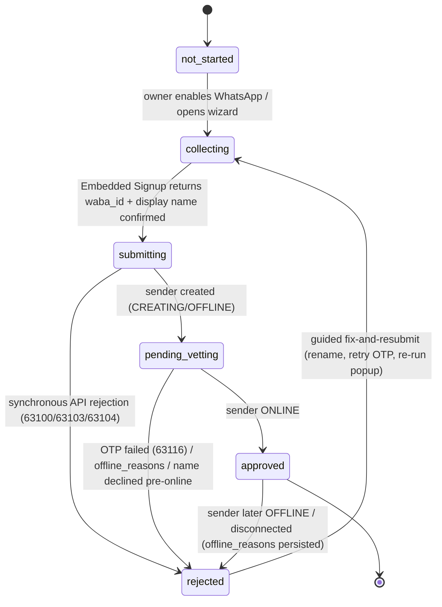

# WhatsApp Sender Registration & WABA Onboarding — Plan

**Status: Planned — not started.**

Every Rivus business gets one rented Twilio number that fronts SMS, voice, and WhatsApp
(`packages/api/src/services/twilio.ts` provisions it; `packages/api/src/routes/account-channels.ts`
enables it). SMS and voice go live at purchase — the provisioner attaches their webhooks in the
rental call — but WhatsApp additionally requires the number to be registered as a **WhatsApp
sender** under a **WhatsApp Business Account (WABA)** on Meta's platform. Today that is a manual
console task per business; this plan automates it, closing the existing `TODO(twilio)` in
`twilio.ts` ("automate sender registration via POST messaging.twilio.com/v2/Channels/Senders once
WABA onboarding is set up"). It is the companion to **[A2P_10DLC_PLAN.md](./A2P_10DLC_PLAN.md)**:
the two channels share onboarding identity data, reuse each other's wizard patterns, and are each
other's fallback (10DLC §9 names WhatsApp as its escape hatch; §10 here returns the favor).

> **Volatile-facts convention used throughout:** exact fees, tier thresholds, caps, status enums,
> and Twilio/Meta endpoint shapes change frequently. Anything marked **[verify at build]** must be
> checked against current Twilio/Meta docs when the phase that uses it is implemented. Claims that
> could not be confirmed from an official page at all are listed as **UNVERIFIED** in §13. The
> *shape* of the flow (Embedded Signup → WABA → sender create → OTP → online → Meta display-name
> review) is Twilio's documented ISV pattern and is safe to plan against.

---

## 1. Why small-business WhatsApp onboarding fails — and what Rivus does about it

This is the heart of the plan. The pivotal difference from 10DLC: **for SMS, outbound is blocked
or heavily filtered until a review board approves the business; on WhatsApp, an unverified
mom-and-pop is fully usable on day one.** Meta business verification is a *scaling* step, not a
launch gate. Rivus's traffic is inbound-first (the customer always messages the business), which
lands entirely inside Meta's free, unlimited lane. How far a business gets **without** Meta
business verification (values **[verify at build]** — tiers changed as recently as Oct 2025):

| Capability | Unverified business | Verified business |
|---|---|---|
| Replies inside the 24-hour customer service window | **Unlimited, free-form, free** — service conversations are free and don't count against messaging limits | Same |
| Business-initiated (template) messages | 250 unique recipients per rolling 24h, portfolio-wide; can reach the 2,000 tier without verifying by sending 2,000 delivered high-quality template messages in 30 days | 2,000 → 10,000 → 100,000 → unlimited (auto-scales on quality + utilization) |
| Registered phone numbers | 2 per business portfolio | 20 |
| Display name | Yes (subject to Meta's post-registration review) | Same, plus Official Business Account (blue check) eligibility |

Rivus's agent only ever *replies*, so the 250-recipient template cap does not touch the core
product. Verification becomes genuinely necessary only when Rivus later initiates conversations at
scale (template reminders — the second `TODO(twilio)` in `twilio.ts`) beyond 250 unique
customers/day, or a business wants the blue check.

The failure modes that remain, and their mitigations — most eliminated *structurally*:

| # | Failure mode | Root cause | Rivus mitigation |
|---|--------------|------------|------------------|
| 1 | **Owner has no Facebook presence** | Embedded Signup requires authenticating "using their Facebook or Meta Business Credentials"; many mom-and-pops have neither. | A Meta Business Portfolio can be **created inside the Embedded Signup popup** — no pre-existing Business Manager, page, or website needed. The only hard prerequisite is a Facebook/Meta login; the wizard's pre-flight step says exactly that before launching the popup. |
| 2 | **Display name rejected** | Meta reviews the name *after* registration. Generic ("Nails"), geographic-only, endorsement-implying ("Official"), Meta-product, or third-party names get DECLINED — capping the sender at 250 business-initiated messages/24h and risking disconnection **[verify at build]**. | Pre-lint the name against a Rivus-maintained rule list (content rules are **UNVERIFIED** snippets — confirm at build, §13). Default it to `Account.name` (the DBA customers know — the snippet-sourced guidelines expect the trade name, and no rule requiring the legal name was found; same **UNVERIFIED** caveat). Track `name_status`; on DECLINED drive a guided rename (10 changes per 30 days allowed **[verify at build]**). |
| 3 | **Number already on WhatsApp** | A number active on consumer/Business-app WhatsApp "cannot be registered unless they are deleted first" — owners often run personal WhatsApp on the shop line. | Structural: register the **rented Twilio number**, fresh and never WhatsApp-bound. Bring-your-own-number is a later, guided path (§5 `path`) with a "delete your existing WhatsApp account first" preflight. |
| 4 | **OTP never completed** | Meta verifies ownership with an SMS/voice OTP to the number being registered; owners miss it. | Structural: for Twilio SMS-capable numbers verification is "Automatic. Twilio handles the verification automatically" — Twilio receives the OTP itself; in the ISV flow, Twilio numbers with `featureType: 'only_waba_sharing'` **skip the OTP step entirely** **[verify at build]**. The owner never sees a code. |
| 5 | **Business-verification document mismatch** | Verification checks the **legal** name/address against official documents; DBA-named submissions or self-filed docs without seal/signature fail (Meta troubleshooting guidance — **UNVERIFIED** verbatim, §13). | Structural: **don't verify at onboarding.** Launch unverified at the 250 tier. When verification is genuinely needed, reuse the legal identity the 10DLC wizard already collected (`A2P_10DLC_PLAN.md` §6 — legal-vs-DBA copy, address normalization) so the two channels never ask twice. |
| 6 | **WABA number-cap exhaustion** | Twilio error 63104: "The maximum number of phone numbers allowed by Meta has been reached for your WABA" (2 unverified / 20 verified **[verify at build]**). | Structural: the per-customer-WABA topology (§4.1) means each portfolio holds only that business's 1–2 numbers. The cap is only reachable in the rejected shared-WABA topology. |
| 7 | **Payment-method confusion at Meta** | Tech Provider clients normally attach a credit card to their WABA; error 63103 when a payment method can't be assigned (e.g. a stale one — Meta only allows revoking, never removing). | Structural: under the Twilio Partner Solution, **Twilio's credit line attaches to the customer WABA** — "Meta doesn't bill ISVs directly" — and customers never enter a card. A WABA with a stuck payment method is fixed by creating a fresh WABA in the flow (the wizard defaults to "create new"). |
| 8 | **Popup abandoned mid-flow** | Embedded Signup is a Meta-hosted popup; blockers, webviews, and distraction strand registrations half-done. | Registration is a resumable state machine (§6), not a one-shot call: `collecting` persists until the popup's message-event returns `waba_id`/`phone_number_id`, and the settings card shows "Resume WhatsApp setup" rather than an error. Popup-hostile contexts route to a browser flow (§12.7). |

## 2. Strategy: keeping rejection and friction low

The core insight mirrors the 10DLC plan: **Rivus standardizes everything that usually fails — the
phone number, the OTP, the webhook wiring, the Meta billing relationship, the messaging pattern —
and lets only two things vary per business: a Facebook login and a display name.**

Concrete tactics, in priority order:

1. **Register the Rivus-rented Twilio number, not the owner's.** WhatsApp-clean (failure mode 3
   gone), SMS-capable so the OTP is automatic/skippable (mode 4 gone), webhooks already attached.
2. **Launch unverified, on purpose.** Defer Meta business verification until a business needs
   >250 business-initiated recipients/24h or the blue check — the riskiest step for a
   DBA-operating, website-less business simply leaves onboarding. (Twilio's Self Sign-up wording
   that unverified portfolios must verify "before you can move into production" is ambiguous
   against Meta's usable 250 tier — **[verify at build]**, §13.)
3. **One WABA per customer, created inside Embedded Signup.** No pre-existing Meta assets
   required; the popup creates the portfolio and WABA in-line (§4.1).
4. **Display name defaulted and linted.** Prefill `Account.name`, lint against prohibited
   patterns. Meta reviews post-hoc, so also *track* the outcome and make DECLINED a guided
   rename, not a support ticket.
5. **Inside-the-window messaging only, at first.** Every agent send is a reply inside the 24-hour
   customer service window — free-form, free, no template-approval surface at all. Template
   messaging is a separate later plan (§3), so template rejection risk is deferred wholesale.
6. **Persist every rejection** (`whatsappRegistration.rejection`, Sender `offline_reasons`,
   `name_status`) and drive fix-and-resubmit UX from stored state (§6). **Human-in-the-loop
   early:** Phase 1 is staff-assisted registration with honest product status; automation ramps
   as pass-rate data accumulates (§9).

Target: **>95% of businesses that complete the Embedded Signup popup reach an ONLINE sender with
zero human intervention**, display-name first-pass approval **>90%**, median enable-to-online time
measured per path.

## 3. Goals / Non-goals

**Goals**

- A business that enables WhatsApp reaches a working sender without anyone opening the Twilio
  console — the `TODO(twilio)` in `packages/api/src/services/twilio.ts` closed.
- **No Meta business verification required to launch.** The unverified 250 tier is the supported
  landing state; verification is an optional, later, assisted step.
- Registration status is first-class product state: stored, visible in the settings card, driving
  the UI (mirroring `smsRegistration`).
- The owner's total burden: one Facebook login, one popup, one display-name confirmation — no
  visible OTP on the default path. Registration state survives disable/re-enable like the number.
- Rejections and regressions (name declined, sender OFFLINE) are guided workflow states.

**Non-goals**

- **Business-initiated template messaging** (reminders outside the 24-hour window, via the Content
  API) — the *other* `TODO(twilio)` in `twilio.ts`. This plan's data model leaves room, but
  template authoring/approval and the verification push it implies are a separate plan.
- Marketing messages — Meta has blocked WhatsApp marketing templates to US numbers since
  April 1, 2025, no announced end date **[verify at build]**; out of scope regardless.
- WhatsApp registration for **Plivo- or zernio-held numbers**. Mirrors the 10DLC plan's Plivo
  stance: migrate the number to Twilio first (`packages/api/src/services/messaging-provider.ts`),
  then register it here. zernio has never been live.
- Official Business Account (blue check) automation — needs verification + 30 days on-platform;
  offer manually to businesses that ask.
- Multi-number-per-business, non-US numbers (`TWILIO_NUMBER_COUNTRY` defaults `US`), and the
  WhatsApp Sandbox (shared test number, joined-users-only — irrelevant to production onboarding).

## 4. Architecture

### 4.1 WABA topology: customer-owned WABA per business (recommended)

| | (a) **Customer-owned WABA via Embedded Signup** (recommended) | (b) Rivus-hosted senders under one Rivus WABA |
|---|---|---|
| Meta model | Rivus becomes a **Meta Tech Provider** whose app links to **Twilio's Partner Solution**; each business creates (in the popup) and owns its WABA | All customer senders live in Rivus's own WABA |
| Twilio fit | The documented ISV path: "Customers need to create a new WhatsApp Business Account (WABA) for Twilio" | Blocked by a hard constraint: "There is a one-to-one relationship between a Twilio account, subaccount, or project and a WABA" and "You can't use multiple WABAs in one Twilio account" |
| Policy fit | The supported pattern | Meta's service-provider terms reserve on-behalf-of messaging for authorized Solution Providers, and display-name guidelines prohibit names "containing the name of a management company or any other third party" (**UNVERIFIED** verbatim, §13) — distinct customer identities inside Rivus's WABA are policy-unsupported |
| Caps | Each portfolio's 2/20-number cap never binds at one number per business | All customers share one portfolio's number cap and messaging limits — error 63104 territory at trivial scale |
| Quality blast radius | A spammy business damages only its own quality rating/limits | One bad actor degrades every customer |
| Cost to Rivus | One-time Tech Provider setup (§8 step 0) — "3-4 weeks" per Twilio; onboarding capped at 10 → 200 new customers per rolling 7 days **[verify at build]** | None up-front — the only thing in its favor |

**Recommendation: (a).** Topology (b) fails Twilio's one-WABA-per-account constraint before Meta
policy even enters; note it is *policy-unsupported rather than proven technically impossible* (§13).
**The forcing consequence:** one WABA per Twilio (sub)account + one WABA per customer ⇒ **one
Twilio subaccount per customer business**, created programmatically at WhatsApp enable (Twilio ISV
docs: subaccount per customer, `friendlyName` = business name). The 10DLC plan left subaccounts
optional (its §11.3); **this plan forces that decision** — coordinate before either plan's Phase 2
locks in (§12.1).

```
Meta side                                    Twilio side
─────────                                    ───────────
Business portfolio (customer-owned)          Rivus parent account (today's credentials)
  └─ WABA (customer-owned, created            └─ Subaccount per business (AC…, new)
      in Embedded Signup)      ←── 1 : 1 ──→      └─ WhatsApp Sender (XE…) on the
        └─ phone number                               rented number (PN…, parent-rented)
            (the same number SMS/voice use)
```

### 4.2 Sender lifecycle

The Sender resource's documented lifecycle (statuses **[verify at build]** — the enum also lists
`PENDING_VERIFICATION`, `ONLINE:UPDATING`, `TWILIO_REVIEW`, `DRAFT`, `STUBBED` with no documented
meanings, §13):

```
create → CREATING → OFFLINE → (OTP; automatic for Twilio SMS numbers) → VERIFYING → ONLINE
                                                                            │
          Meta display-name review runs AFTER registration ────────────────┤
          (name_status: PENDING_REVIEW → APPROVED | DECLINED)              ▼
                                     ONLINE with offline_reasons[] / OFFLINE on regression
```

Twilio-side registration is minutes-scale ("Immediately after registration, the status value will
be OFFLINE. Wait a few minutes, then make the request again"). **Status is polled, not pushed**:
no sender-lifecycle webhook is documented — the Sender's `webhook` object configures *message*
callbacks, not registration status **[verify at build]** — so unlike the 10DLC plan (callbacks
primary, polling backstop), here the **poller is primary** (§8), paced per "Allow several minutes
between Senders API requests."

### 4.3 Composition with one-number-across-channels and the provisioner

- **Same number, all channels.** Meta explicitly permits it: a registered number "can still be
  used for everyday purposes, such as calling and text messages". Twilio-side coexistence is
  presumed by the ISV flow's `only_waba_sharing` for "Twilio SMS numbers", but the confirming help
  article didn't render — **UNVERIFIED**, §13. Consequence: the same `PN…` number may be
  **simultaneously mid-10DLC and mid-WhatsApp registration**; no source documents an ordering
  constraint — **[verify at build]** (§12.10).
- **`providerRef` is sacred.** `channels.whatsapp.providerRef` holds the `PN…` SID that
  `twilioOwnsRef` fingerprints for number-sharing and outbound routing
  (`packages/api/src/services/twilio.ts`, `messaging-provider.ts`). The sender SID (`XE…`),
  `waba_id`, and subaccount SID go in **new fields** on `whatsappRegistration` (§5), never in
  `providerRef`, or routing breaks.
- **Registration is not a provisioner step.** `TwilioProvisioner.provision()` stays a synchronous
  rent-a-number call — sender registration needs the *owner's* interactive Embedded Signup, so it
  cannot live inside `provision()`. Instead `POST /channels/whatsapp/enable`
  (`packages/api/src/routes/account-channels.ts`) keeps renting/adopting the number exactly as
  today and additionally initializes `whatsappRegistration` to `collecting`; a new orchestrator
  (`packages/api/src/services/twilio-whatsapp-senders.ts`, same fetch-adapter style as
  `twilio.ts`, injectable `fetchImpl`) drives the sender lifecycle after the popup returns. The
  route's production 503 gate and 502 provider-failure mapping stay untouched.
- **Inbound/outbound paths already exist** and must keep working unchanged:
  `packages/api/src/routes/agent-messaging-twilio.ts` (inbound + status callbacks) →
  `dispatchPhoneChannelEvent` (`packages/api/src/routes/agent-phone-shared.ts`), and
  `TwilioWhatsappSender` (`twilio.ts`) outbound. The sender-create call sets `callback_url` =
  `TWILIO_WHATSAPP_WEBHOOK_URL` so day-one inbound flows to the existing route.

## 5. Data model additions (`@rivus/core`)

Top-level `Account.whatsappRegistration`, alongside `channels` and the planned `smsRegistration` —
**not** an extension of `channels.whatsapp`: `setChannelConfig` "replac[es] that channel's
subdocument wholesale" (`packages/api/src/repositories/types.ts`), so per-channel extension fields
would be silently dropped on the next toggle. Meta's model is per-number+per-WABA, but Rivus's is
one number per business, so per-account placement holds (revisit if multi-number ever lands).

```ts
// packages/core/src/types.ts (new)
export type WhatsappRegistrationState =
  | 'not_started'      // WhatsApp never enabled, or enabled pre-plan (backfill)
  | 'collecting'       // wizard/Embedded Signup open; waba_id not yet returned
  | 'submitting'       // subaccount + Senders API calls in flight
  | 'pending_vetting'  // sender created; awaiting OTP/ONLINE and/or display-name review
  | 'approved'         // sender ONLINE; channel fully live
  | 'rejected';        // failed or regressed; rejection persisted; resubmit available

export type WhatsappRegistrationPath =
  | ''                 // undecided
  | 'rivus_number'     // default: the rented Twilio number; OTP invisible
  | 'byo_number';      // owner's own number; manual OTP + WhatsApp-clean preflight (Phase 3)

export interface WhatsappRegistration {
  state: WhatsappRegistrationState;
  path: WhatsappRegistrationPath;
  /** Which wait is outstanding while pending_vetting: 'otp' | 'sender_review' | 'display_name'. */
  pendingStage: string;

  // Provider/Meta ids, '' until created. Prefixes indicative — [verify at build].
  subaccountSid: string;      // per-business Twilio subaccount (AC…)
  senderSid: string;          // Senders API resource (XE…)
  wabaId: string;             // Meta WABA id, from the Embedded Signup callback
  phoneNumberId: string;      // Meta business phone number id, same callback

  /** Display name shown to WhatsApp users; reviewed by Meta after registration. */
  displayName: {
    value: string;                                // defaults to Account.name
    status: 'pending' | 'approved' | 'declined';  // mirrors Meta name_status [verify at build]
    reviewedAt: IsoDateString | null;
  };

  // Mirrors of Sender.properties — informational, drive UI copy, never gates.
  qualityRating: string;      // e.g. 'HIGH' [verify at build]
  messagingLimit: string;     // e.g. '10K Customers/24hr' — portfolio-model rendering unverified

  rejection: null | {
    stage: 'embedded_signup' | 'subaccount' | 'sender_create' | 'otp' | 'display_name' | 'sender_offline';
    code: string;             // Twilio error code (63100/63103/63104/63116…) or Meta reason
    message: string;          // human-readable, shown in the fix-it UX
    at: IsoDateString;
  };
  submittedAt: IsoDateString | null;
  approvedAt: IsoDateString | null;
  /** Append-only audit of state transitions (at, from, to, note). */
  history: Array<{ at: IsoDateString; from: string; to: string; note: string }>;
}
```

Wiring, following the `smsRegistration` precedent (`A2P_10DLC_PLAN.md` §4.2):

- `packages/core/src/schemas.ts`: zod schema + all-empty `not_started` default always present
  (plain reads, never existence checks — the `AccountChannels` pattern).
- Repositories: `accounts.setWhatsappRegistration(...)` in
  `packages/api/src/repositories/types.ts`, `memory.ts`, `mongo.ts`, mirroring `setChannelConfig`
  (a business-info PATCH can never touch registration state).
- `packages/api/src/presenters.ts` (`toPublicAccount`): expose **state, path, pendingStage,
  displayName.value/status, rejection message, timestamps** only; `subaccountSid`/`senderSid`/
  `wabaId`/`phoneNumberId` stay server-side. Matching additions to
  `packages/api/src/http-schemas.ts` and the app client (`packages/app/src/api/client.ts`).
- Config: new vars join the Twilio block in `packages/api/src/config.ts` — e.g.
  `TWILIO_MESSAGING_API_URL` (default `https://messaging.twilio.com`; the Senders API base differs
  from `TWILIO_API_URL` **[verify at build]**) and the Meta app / Embedded Signup config / Twilio
  Partner Solution ids for the popup (names directional **[verify at build]**). Every new var must
  also land in `FORWARDED_VARS` (`packages/api/worker/env.ts`), the `Env` interface
  (`packages/api/worker/index.ts`), wrangler secrets/vars, `.env.example`, and
  `packages/api/README.md` — the documented trap.

## 6. Registration state machine



Rules:

- Transitions are driven by the **polling reconciler** (§8) — the inverse of the 10DLC machine's
  webhook-first design, because no sender-status callback is documented. Every transition appends
  to `history`.
- `rejected` always carries a persisted `rejection` and re-enters at `collecting` focused on the
  failed stage. A `path` switch (`rivus_number` ↔ `byo_number`) is a `rejected → collecting`
  transition with `path` changed — the 10DLC path-switch convention.
- **One deliberate deviation from the SMS machine:** `approved` is not terminal. A live sender can
  regress (Meta disconnection, later name decline, `offline_reasons`), so `approved → rejected`
  exists and the reconciler keeps watching approved senders at low cadence.
- **Gate: outbound WhatsApp sends are attempted only in `approved`.** Before that there is no
  sender, so sends could only fail at Twilio; the gate makes the failure honest and testable.
  Enforce at the dispatch seam (`dispatchPhoneChannelEvent` /
  `packages/api/src/services/agent/whatsapp/adapter.ts`), not inside `TwilioWhatsappSender` — as
  `A2P_10DLC_PLAN.md` §4.3 prescribes for SMS. (Unlike SMS, inbound cannot arrive
  pre-registration — no sender, no traffic; post-approval regressions already surface via
  `WHATSAPP_FAILED_EVENT` → `flagDeliveryFailure` in `agent-phone-shared.ts`.)
- A name DECLINED while ONLINE does **not** flip the channel off: the sender may keep working,
  capped at 250 business-initiated messages/24h with disconnection risk **[verify at build]** —
  state stays `approved` with `displayName.status: 'declined'` driving a warning pill + rename
  action (§7); it becomes `rejected(stage: 'display_name')` only if Meta actually disconnects.

## 7. Onboarding UX & data collection

**When:** at WhatsApp enable, in the settings channel card (`packages/app/app/settings.tsx` — the
`whatsapp` entry of `CHANNELS`, rendered by `ChannelCard`). The toggle keeps its current behavior
(rent/adopt the number via `POST /v1/account/channels/whatsapp/enable`); the response now carries
`whatsappRegistration: collecting` and the card opens the setup flow. A status pill sits between
the `CopyField` (the number) and the error line, driven by `state`/`pendingStage` — the same slot
the 10DLC plan uses.

**Path routing** — decided up front, recorded in §5's `path` (the analog of the 10DLC plan's §5
decision tree):

```
Owner has — or will create — a Facebook/Meta login?
├─ NO  → no WhatsApp: the card says so honestly; SMS/voice/email carry the account (§10)
└─ YES → whose number backs the sender?
         ├─ Rivus's rented Twilio number (default) → rivus_number — OTP invisible (step 3)
         └─ Owner's own number → byo_number (Phase 3) — WhatsApp-clean preflight, visible OTP;
            a number already on another WABA/BSP goes through migration-in instead (§9 Phase 3)
```

**The flow (default `rivus_number` path):**

1. **Pre-flight** — one screen: "You'll sign in with Facebook. No website, no Facebook page, no
   documents needed." The only per-owner prerequisite is the login (§1 row 1).
2. **Embedded Signup popup** — Meta's JS SDK launched with Rivus's Meta app id + Twilio's Partner
   Solution id, `featureType: 'only_waba_sharing'` for the Rivus number **[verify at build]**.
   Inside it the owner signs in, accepts WhatsApp terms, **creates** (or selects) the business
   portfolio and WABA, and confirms the pre-filled phone number. A message-event listener yields
   `{phone_number_id, waba_id}`; the app POSTs them to a new authenticated API route which
   persists them and flips `collecting → submitting`. (The popup needs a real browser context;
   Expo embedding is an open question — §12.7.)
3. **The OTP moment — invisible by default.** Rivus-number path: skipped (`only_waba_sharing`) or
   auto-handled (Twilio receives the SMS itself); the wizard just shows "Verifying your number…".
   Only the `byo_number` path (Phase 3) shows an enter-the-code screen — the code arrives on
   *their* phone via SMS or voice call and is submitted through the API (§8 step 5), with a
   voice-call re-send fallback per error 63116 guidance.
4. **Display name** — prefilled `Account.name`, linted live (§2 tactic 4), copy: "This is the name
   customers see on WhatsApp. Use your shop's everyday name." One confirmation tap.
5. **Pending → done** — "WhatsApp: setting up (usually minutes)" while `pending_vetting`, then
   "name in review" while `displayName.status` is `pending` (no official review SLA — §13). On
   `approved`, notify the owner (existing notifier). On `rejected`, the pill becomes an action
   ("Fix your WhatsApp name and resubmit") fed by the persisted `rejection.message` through a
   rejection-code → plain-language copy map, grown from real rejections (10DLC convention).

**Data collected:** nothing beyond the display name — identity prefills from
`Account.name/phone/address/website` (`packages/core/src/types.ts`); the heavyweight legal
identity (legal name, EIN, documents) is *not needed* unless Meta business verification is, at
which point the **10DLC wizard's collected identity is reused** (`A2P_10DLC_PLAN.md` §6), never
re-asked. That shared-identity contract is the deepest cross-reference between the two plans. (It
is a *data* contract, not a shared Twilio resource: the 10DLC plan's §3 non-goal describes WhatsApp
as sharing "the Trust Hub secondary profile this plan creates", but the Senders API sets
`compliance` to null for WhatsApp senders, so nothing on this side consumes a Trust Hub bundle
**[verify at build]** — what the plans actually share is the identity data itself.)

**Refresh caveat:** the app has no push/refresh channel — `session.account` updates only when an
API response is adopted (`packages/app/src/auth/AuthContext.tsx`) — so the server-side
`pending_vetting → approved` flip needs refetch-on-focus or a light poll while pending (§12.8).

All new UI follows `DESIGN_SYSTEM.md` tokens/components.

## 8. Twilio/Meta API flow (directional — **verify every endpoint/field at build time**)

One-time Rivus setup (Phase 0, weeks of external lead time — start immediately):

0. Rivus becomes a **Meta Tech Provider on Twilio's Partner Solution**: verify Rivus's own
   business with Meta; create a *new* Meta app; pass App Review (two screen recordings) for
   Advanced access to `whatsapp_business_messaging` + `whatsapp_business_management`; complete
   Access Verification; link the app to Twilio's Partner Solution; register Rivus's own first
   sender via Console Self Sign-up; enable 2FA in Business Manager. Twilio: "Steps 1 and 2 usually
   take 3-4 weeks." Onboarding caps: 10 new customers per rolling 7 days before the verification
   steps, 200 after **[verify at build]**.

Per business, driven by the orchestrator (`packages/api/src/services/twilio-whatsapp-senders.ts`):

1. **Enable** — `POST /v1/account/channels/whatsapp/enable` rents/adopts the number as today and
   initializes `whatsappRegistration` to `collecting`.
2. **Subaccount** — create via the Twilio Accounts API (`friendlyName` = business name), store
   `subaccountSid` **[verify endpoint at build]**. Whether the parent-rented `PN…` number must
   transfer into the subaccount or can be registered from the parent is unresolved (§12.2).
3. **Embedded Signup** (owner, in-app; §7 step 2) — persist `waba_id` + `phone_number_id`;
   `collecting → submitting`. (Meta's generic flow also returns an exchangeable token code;
   whether Rivus must exchange it or Twilio's Partner Solution consumes it is **UNVERIFIED**.)
4. **Create the sender** — `POST https://messaging.twilio.com/v2/Channels/Senders`
   **[verify at build]** in the subaccount's context, body (shapes **[verify at build]**):
   `sender_id: "whatsapp:+1…"`, `configuration.waba_id` (the first sender binds the WABA 1:1 to
   the subaccount), `configuration.verification_method: "sms"`, `profile.name` (the linted display
   name — "Required for WhatsApp senders"), `webhook.callback_url` = `TWILIO_WHATSAPP_WEBHOOK_URL`
   plus `status_callback_url` for delivery receipts. Store `senderSid` (`XE…`);
   `submitting → pending_vetting`. Synchronous failures (63100 validation, 63103 payment method,
   63104 number cap) → `rejected` with code+message persisted.
5. **OTP** — Rivus-number path: automatic or skipped (§7 step 3); on error 63116 (OTP not
   received), retry later or re-request with `verification_method: "voice"` per the error doc.
   BYO path: owner receives the code; submit `POST /v2/Channels/Senders/{Sid}` with
   `{"configuration": {"verification_code": "123456"}}` → status `VERIFYING`.
6. **Poll to ONLINE** — `GET /v2/Channels/Senders/{Sid}` until `status: "ONLINE"` (typically
   minutes), pacing "several minutes between Senders API requests". On ONLINE → `approved`,
   `approvedAt` set, owner notified. On OFFLINE with `offline_reasons` → `rejected` with the first
   `{code, message}` persisted.
7. **Display-name review tracking** — Meta reviews the name after registration (`name_status`:
   `PENDING_REVIEW`/`APPROVED`/`DECLINED`; surfaced via the Sender resource or WhatsApp Manager —
   exact surface **[verify at build]**). DECLINED → §6's declined handling and §7's rename flow
   (10 changes/30 days; 14 days to re-register after an approved change **[verify at build]**).
8. **Sends** — `TwilioWhatsappSender` (`twilio.ts`) keeps sending `From: whatsapp:+1…`. If the
   sender lives in a subaccount, outbound Messages calls likely need the subaccount context
   (parent credentials on subaccount-scoped paths are standard Twilio, but **[verify at build]**),
   threaded from `whatsappRegistration.subaccountSid` alongside the existing `providerRef`
   ride-along in `packages/api/src/services/agent/whatsapp/adapter.ts`.

**Status monitoring:** a **reconciler poller is the primary mechanism** — no registration-status
webhook is documented (§4.2). Poll accounts in `submitting`/`pending_vetting` on a minutes-scale
backoff, and `approved` accounts daily for regression (`offline_reasons`, `quality_rating`,
`messaging_limit`, `name_status`). If a sender-status callback is discovered at build, add it the
10DLC way (new authenticated route reusing `packages/api/src/routes/twilio-webhook-auth.ts`,
**[verify signing at build]** plus the subaccount-token question, §12.6). Webhooks would make it
fast; polling makes it correct.

**Idempotency:** every step records its SID/id before proceeding and skips creation when already
present (`subaccountSid` → skip subaccount create; `senderSid` → skip sender create) — the
`TwilioProvisioner.provision` existing-address pattern — so a crashed or retried orchestration
resumes instead of duplicating resources. Senders API pacing doubles as natural retry spacing.

## 9. Implementation phases

**Phase 0 — Rivus-side Meta/Twilio prerequisites (start now; 3-4 weeks external lead time)**
- Tech Provider setup per §8 step 0; no repo changes. Exit: Advanced access + Access Verification
  granted, app linked to Twilio's Partner Solution, Rivus's own sender ONLINE, popup renders.

**Phase 1 — Manual-assisted registration + status tracking (ship first, unblocks immediately)**
- Data model (§5), state machine (§6), presenters, settings-card status pill, dispatch-seam gate —
  the gate lands only after the §12.9 backfill seeds pre-plan console-registered senders as
  `approved`; they default to `not_started`, and gating them would cut off accounts working today.
- Admin endpoints (`packages/api/src/routes/admin.ts`, staff-gated like the existing
  accounts/switch-company/seed routes) for staff to record `senderSid`/`wabaId`/state while
  performing registration **by hand in the Twilio console** (Self Sign-up) with the owner on a
  call.
- Exit: 2-3 pilot businesses ONLINE via console; truthful status end-to-end; pilot display names
  approved (validating the lint list).

**Phase 2 — Automated Rivus-number path (the OTP-free default)**
- Embedded Signup embedded in the app (§7), the persist-IDs route, subaccount creation, the
  `twilio-whatsapp-senders.ts` orchestrator (§8 steps 2-6), reconciler poller, owner
  notifications, refetch-on-focus for the pending pill.
- Exit: a fresh business goes toggle → popup → ONLINE with zero staff touches; enable-to-online
  and popup-completion rates measured; Phase-1 pilots backfilled into the data model.

**Phase 3 — BYO-number path + rejection/rename loops**
- Manual OTP screen (SMS/voice fallback per 63116), WhatsApp-clean preflight, migration-in from
  another BSP/WABA (2FA off, same data-localization region **[verify at build]**), name-declined
  rename flow, rejection-code copy map grown from Phase 2 data.
- Exit: a customer-owned number registers end-to-end; a forced name decline recovers in-product.

**Phase 4 — Hardening + template groundwork**
- `approved`-state regression watching (offline/quality/limit changes → owner comms), metrics
  dashboard (popup completion, first-pass name approval, enable-to-online, rejection
  distribution), and an assisted Meta business-verification flow reusing the 10DLC identity data
  for businesses nearing the 250 template cap — the on-ramp to the separate template plan (the
  second `TODO(twilio)`).

Each phase lands behind the usual gates (`pnpm lint && pnpm type-check && pnpm test`), with the
orchestrator tested hermetically against a fake Twilio `fetchImpl` like the existing
`packages/api/test/twilio.test.ts` — no live Twilio/Meta calls in tests.

## 10. Fallbacks

- **SMS while WhatsApp is pending (or forever).** Channels are independent: the number is live for
  SMS/voice the moment it is rented, so a business waiting on WhatsApp — or one that can never
  pass — runs on SMS + voice + email (SMS subject to its own 10DLC approval gate; with both
  pending, voice + email are live day one). The plans are **reciprocal fallbacks by design** —
  10DLC §9 offers WhatsApp when SMS registration fails; this plan offers SMS (or its toll-free
  fallback, 10DLC §9) when a WABA can't be approved.
- **What "can never pass" looks like here:** no Facebook login and unwilling to create one; a
  display name declined repeatedly with no acceptable variant; a BYO number stuck on another WABA
  the owner can't unlock. None of these block the *number* — the WhatsApp card shows the honest
  rejected state and reason while the other channel rows are visibly unaffected
  (`packages/app/app/settings.tsx` tracks busy/error per channel).
- **White-glove** — Phase 1's admin tooling stays alive forever as the staff-assisted path, and is
  the escalation route when automation exhausts retries — same convention as the 10DLC plan.
- **Alternative providers are not a fallback.** Plivo's WhatsApp registration is its own manual
  console step (`TODO(plivo)` in `packages/api/src/services/plivo.ts`) and zernio has never been
  live — only the Twilio path is being automated; others migrate in first (§3).

## 11. Costs to decide (business decision — **verify current amounts at build time**)

Do not trust remembered numbers; pull current pricing from Twilio's WhatsApp pricing page and
Meta's per-country rate cards when deciding. The categories:

| Cost | Shape | Notes |
|------|-------|-------|
| Twilio per-message fee | $0.005 per WhatsApp message, inbound or outbound **[verify at build]** | The only per-message cost on Rivus's core traffic (below); no documented monthly per-sender or registration fee |
| Meta template fees | per **delivered** template message, by category + recipient country **[verify at build]** | Marketing/utility/authentication rates; utility free inside an open service window; **US marketing blocked since Apr 2025**; irrelevant until the template plan lands |
| Meta service conversations | **$0** | User-initiated conversations and all non-template replies inside the 24h window are free — **Rivus's entire current send pattern costs only Twilio's $0.005/message** |
| WABA / verification / sender registration | no documented fee | An absence claim from official pricing pages, not an explicit "free" — §13 |
| Number rental | already sunk | The sender rides the same rented number SMS/voice pay for |
| Rivus Tech Provider setup | staff time, no listed fee | 3-4 weeks calendar; engineering + a screen-recorded App Review |

**Decide:** absorb the ~$0.005/message in plan pricing (simplest story: "WhatsApp included" — at
mom-and-pop volumes, cents per month per business) vs metering. Template pricing (the real Meta
COGS) is deferred to the template plan, but flag now: **reminder-style business-initiated
messaging will carry per-message Meta fees and a verification push — price that feature, not this
channel.**

## 12. Open decisions / questions for the team

1. **Subaccount restructuring** — this plan forces per-customer subaccounts (§4.1); the 10DLC plan
   treats them as optional (its §11.3). Decide once, jointly, before either plan's Phase 2:
   subaccounts touch credential assumptions in `messaging-provider.ts`, webhook verification, and
   billing attribution.
2. **Where the number lives** — can the parent-account `PN…` number back a subaccount's sender, or
   must it transfer into the subaccount (and do SMS/voice webhooks and any 10DLC attachment
   survive the move)? Undocumented — resolve with a live spike **[verify at build]**.
3. **BYO numbers at all?** The `byo_number` path (Phase 3) adds the OTP screen, WhatsApp-clean
   preflight, and migration edge cases. If demand is low, cut it and stay "Rivus number only".
4. **Display-name authority** — auto-derive from `Account.name` with a lint (recommended) vs
   free-text with review; and who eyeballs edge cases pre-submit in Phase 1.
5. **When to push Meta business verification** — proactively as a business nears the 250/24h
   template cap (post-template-plan) vs strictly on request. Also whether Twilio will submit
   verification on customers' behalf (documented for Select/Premier Solution Partners;
   applicability to the Twilio model **UNVERIFIED**).
6. **Webhook token mismatch risk** — if webhooks for subaccount-hosted senders sign with the
   subaccount auth token, `twilio-webhook-auth.ts` (keyed by the parent `TWILIO_AUTH_TOKEN`)
   rejects them. Decide storage/lookup of per-subaccount tokens **[verify at build]**.
7. **Embedded Signup surface in Expo** — Meta's JS SDK popup from the native app: in-app browser,
   system browser + deep link back, or a web-only settings page? Prototype in Phase 2 week one.
8. **App refresh** — poll-while-pending vs refetch-on-focus vs notification-driven refetch for the
   `pending_vetting → approved` flip (shared gap with the 10DLC plan; build once).
9. **Backfill** — accounts that enabled WhatsApp pre-plan (console-registered, or holding a number
   with no sender): audit via a Senders API list, then seed `whatsappRegistration` accordingly.
10. **Ordering vs 10DLC on one number** — the same number may be mid-10DLC and mid-WhatsApp
    registration simultaneously; no source documents an interaction or required order
    **[verify at build]** — spike alongside decision 2.
11. **Fee absorption** (§11) — "WhatsApp included" vs metered; align with the SMS fee decision.

## 13. References

URLs believed-current as of mid-2026; Twilio and Meta reorganize docs often — treat titles as
canonical and re-find pages at build time.

- Twilio — Senders API reference; Register senders using the API; Senders API GA changelog:
  `https://www.twilio.com/docs/whatsapp/api/senders`,
  `https://www.twilio.com/docs/whatsapp/register-senders-using-api`,
  `https://www.twilio.com/en-us/changelog/senders-api-whatsapp`
- Twilio — WhatsApp key concepts (WABA 1:1, 24-hour window, Content Templates):
  `https://www.twilio.com/docs/whatsapp/key-concepts`
- Twilio — ISV register-senders, Tech Provider integration guide + FAQ:
  `https://www.twilio.com/docs/whatsapp/isv/…`
- Twilio — Self Sign-up; Migrate numbers and senders:
  `https://www.twilio.com/docs/whatsapp/self-sign-up`,
  `https://www.twilio.com/docs/whatsapp/migrate-numbers-and-senders`
- Twilio — error codes 63100 / 63103 / 63104 / 63116: `https://www.twilio.com/docs/api/errors/…`
- Twilio — WhatsApp pricing; Jul 1, 2025 pricing + US-marketing-pause changelogs:
  `https://www.twilio.com/en-us/whatsapp/pricing`
- Meta — Embedded Signup; Messaging limits; Phone numbers; WABA overview:
  `https://developers.facebook.com/docs/whatsapp/…`
- Meta — Display names; Official Business Accounts; Solution-provider overview; Pricing:
  `https://developers.facebook.com/documentation/business-messaging/whatsapp/…`

**Known uncertainties (UNVERIFIED — resolve before relying on them):**

- Meta's display-name content rules and service-provider terms were read via search snippets (the
  Help Center pages are login-walled) — confirm verbatim at build; the §2 lint list must be built
  from the live page.
- Sender statuses `PENDING_VERIFICATION`, `ONLINE:UPDATING`, `TWILIO_REVIEW`, `DRAFT`, `STUBBED`
  are listed but undefined; the machine assumes the documented CREATING → OFFLINE → VERIFYING →
  ONLINE path. Whether any webhook fires for sender registration status (assume polling-only), and
  whether `configuration.waba_id` can re-parent a sender on update (assume not).
- Twilio-side confirmation that one number simultaneously serves voice + SMS + WhatsApp (help
  article didn't render; Meta-side permission is verbatim-verified), and any 10DLC↔WhatsApp
  interaction on a shared number.
- Twilio Self Sign-up's "must complete business verification before production" wording vs Meta's
  usable unverified 250 tier — live-test whether an unverified sender is fully usable at ONLINE.
- Embedded Signup's exchangeable-token handling under Twilio's Partner Solution; Expo popup
  embedding; display-name review SLA (third-party "1-3 days" only); whether unverified portfolios
  auto-scale past 2,000; OTP validity/retry bounds; every fee, tier, and cap cited above.

Internal code anchors: `packages/api/src/services/twilio.ts` (provisioner + `TwilioWhatsappSender`
+ both `TODO(twilio)` markers — this plan closes the first, the template plan the second),
`packages/api/src/routes/account-channels.ts` (enable flow this plan extends),
`packages/api/src/routes/agent-messaging-twilio.ts` + `packages/api/src/routes/agent-phone-shared.ts`
(inbound webhook + dispatch seam that must keep working, and where the send gate lands),
`packages/core/src/types.ts` (Account model gaining `whatsappRegistration`),
`packages/app/app/settings.tsx` (the WhatsApp channel card gaining the status pill), and
`packages/api/README.md` (the manual-step documentation this plan retires).
